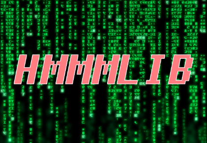

[](https://travis-ci.com/Thornado-Carlkoder/hmmmlib)
[](https://www.codacy.com/gh/Thornado-Carlkoder/hmmmlib?utm_source=github.com&amp;utm_medium=referral&amp;utm_content=Thornado-Carlkoder/hmmmlib&amp;utm_campaign=Badge_Grade)


# HMMMLIB 

#### *Hidden Markov-Model Matrix Library*

* HMM library written in C 
* Has Python bindings allowing it to be used by Python as well
* The library should be made in a modular way such that the user can easily add functionalities


## GOAL

The goal of this project is:

	- To get a strong theoretical understanding of HMM's and different versions of the latter
	- Create a robust and easy to use libeary for both C and python
	- After finishing the initial project make it open source for everyone to add and use

### Project description:
The goal of the project is to implement an efficient C library for hidden Markov models that supports the Forward and Backward algorithms, Viterbi and posterior decoding and parameter optimisation. The focus will be on algorithmic engineering for dense matrix HMMs and we will in particular compare the straightforward implementations with BLAS based linear algebra formulations of the algorithms.


### Learning goals:
A brief and clear presentation of what the student should be able do to after the project. Formulated as 3-5 items, e.g.: 
* The student should be able to describe the general HMM, forward and backward algorithm and Viterbi and posterior decoding
* The student should be able to implement HMM, forward and backward algorithm and Viterbi and posterior decoding - The student should be able to analyse the different implementations of the latter in terms og speed.
* The student should be able to discuss and evaluate the findings of the experiments in contrast to the implementation decisions.


## WEEKLY MEETING:

* INTERNAL: Torsdag kl 11
* THOMAS: Torsdag kl 12

## GENERAL WORK PLAN

1. Make HMM with basic algorithms
2. Make a test framework with BLAS
3. Implement optimised algorithms


### Evaluation problem
Evaluation problem answers the question: what is the probability that a particular sequence of symbols is produced by a particular model?
For evaluation we use two algorithms: the forward algorithm or the backward algorithm

### Decoding problem
Decoding problem answers the question: Given a sequence of symbols (your observations) and a model, what is the most likely sequence of states that produced the sequence.
For decoding we use the Viterbi algorithm and Posterior Decoding.

### Training problem
Training problem answers the question: Given a model structure and a set of sequences, find the model that best fits the data.
For this problem we can use the Baum Welch = forward-backward algorithm

Possible optimisations: 

* Solving the "training" problem as a constrinted optimisation problem and use lagrange multipliers?

## DOCUMENTATION

In this section all the documentation for the library is written as well as the different papers that have been implemented.

## TASK MANAGEMENT 

See the project manager in GITHUB

## RUNNING TIME TESTS

In order to quickly assess improvements to our algorithms, we have automated the running time tests.

Please note that density = 1 - sparseness 

These are the automated running time tests supported:

* Varying alphabet size :`running_time_alphabet_size.py`
* Varying input size: `running_time_input_size.py`
* Varying density: `running_time_sparseness.py`
* Varying state space: `running_time_state_space.py`
* Covarying state space and density: `running_time_state_spaceVSsparseness.py`


Running each of these files with the python interpreter will run a series of tests. For instance, if we want to gauge the running time of increased input size, we will run the following command:

```python3
python running_time_input_size.py > input_size.csv
```

The scripts all output a csv-formatted file to STDOUT and progress diagostics to STDERR. Because of that, it is recommended to pipe the output to a separate file.


Note: If you're using Mac or Windows, the shared object file will likely have a different file extension than what is hardcoded in the binding.py file. Please change the `address_to_so` variable in binding.py accordingly.


## READING MATERIAL

* https://web.stanford.edu/class/cs262/archives/notes/lecture6.pdf
* https://en.wikipedia.org/wiki/Hidden_Markov_model

#### For c programming

* http://c-faq.com/aryptr/dynmuldimary.html
* https://www.dipmat.univpm.it/~demeio/public/the_c_programming_language_2.pdf
* https://developer.ibm.com/articles/au-toughgame/
* https://cdecl.org/
* http://derekmolloy.ie/hello-world-introductions-to-cmake/

### CMAKE

* http://derekmolloy.ie/hello-world-introductions-to-cmake/
